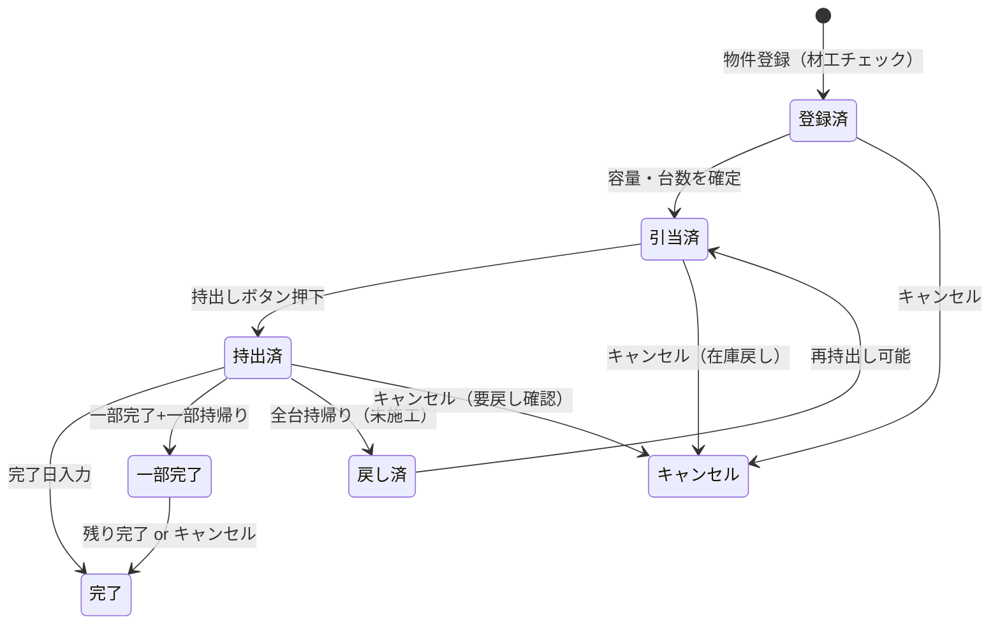

# エアコン持出し・引当フロー — 全パターン設計

## 物件の状態遷移



## ボタンの状態

| 物件ステータス | ボタン表示 | ボタン色 |
|--------------|-----------|---------|
| 引当済（未持出） | **持出し** | 🔵 青 |
| 持出済 | **持出中** | 🟠 オレンジ（押すと戻し操作へ） |
| 一部完了 | **一部完了** | 🟡 黄 |
| 完了 | **完了** | 🟢 緑（操作不可） |
| キャンセル | **取消** | ⚪ グレー |
| 工事のみ（材工なし） | ボタンなし | — |

---

## 全パターン一覧

### ✅ 正常系

| # | パターン | フロー | 在庫処理 |
|---|---------|--------|---------|
| 1 | **通常完了** | 引当→持出し→完了 | 引当時: reserved+1 → 持出し時: 実在庫-1 → 完了: reserved-1 |
| 2 | **複数台完了** | 2台引当→持出し→2台とも完了 | 同上×2 |
| 3 | **工事のみ** | 材工チェックなし | 在庫操作なし。ボタン非表示 |

### ⚠️ 異常・分岐系

| # | パターン | トリガー | アクション |
|---|---------|---------|-----------|
| 4 | **持出しなしで完了** | 完了日入力時に持出し記録なし | ⚠️ 警告「持出し処理がされていません。在庫を減算しますか？」 |
| 5 | **一部完了+持帰り** | 2台中1台完了、1台未施工 | 完了台数入力。持帰り分は戻し処理→拠点在庫に加算 |
| 6 | **全台持帰り** | 施工不可で全台持帰り | 戻しボタン→拠点在庫に全数戻す。ステータス=「引当済」に戻る |
| 7 | **引当後キャンセル** | 物件キャンセル（持出し前） | 引当解除→reserved在庫を戻す |
| 8 | **持出し後キャンセル** | 物件キャンセル（持出し後） | ⚠️ 警告「エアコンが持出し中です。戻し処理を先に行ってください」 |
| 9 | **容量間違い** | 28kwで引当、実際は22kwを持出し | ⚠️ 持出し時に容量チェック。不一致なら警告「引当と異なる容量です。変更しますか？」 |
| 10 | **材工チェック取消** | 持出し後にAccessで材工チェック外す | ⚠️ 同期時に検知→警告「持出し済みですが材工フラグが外れました。確認してください」 |
| 11 | **重複持出し** | 同じ管理Noで2回持出し | ⚠️ 警告「この物件は既に持出し済みです。追加持出しですか？」（既存の仕組みと同様） |
| 12 | **異なる拠点から持出し** | A拠点で引当、B拠点で持出し | ⚠️ 警告「引当拠点と異なります」→ 拠点変更の確認 |
| 13 | **完了後の追加工事** | 完了済み物件にさらにエアコン追加 | 新しい引当を追加OK（既存完了分は変更しない） |
| 14 | **長期間持出し中** | 持出しから○日以上未完了 | 📋 ダッシュボードに「長期持出し中」アラート |

### 🔄 在庫数の整合性

| タイミング | 発注済み在庫(reserved) | 実在庫(stock) |
|-----------|:---:|:---:|
| 引当時（容量確定） | +台数 | 変化なし |
| 持出し時 | 変化なし | -台数 |
| 完了日入力 | -台数 | 変化なし |
| 戻し時 | 変化なし | +台数 |
| キャンセル（持出し前） | -台数 | 変化なし |
| キャンセル（持出し後） | -台数 | +台数（戻し必須） |

---

## UI イメージ

### 物件一覧（管理画面）

```
┌─────────────────────────────────────────────────┐
│ 管理No  物件名           容量    ステータス      │
├─────────────────────────────────────────────────┤
│ 101254  カーサセノ102    36kw×1  [持出し]  🔵    │
│ 101300  メゾンXX201     22kw×2  [持出中]  🟠    │
│ 101355  ガーデン堺103   28kw×1  [完了]    🟢    │
│ 101400  サンリット205   25kw×1  (工事のみ) —    │
└─────────────────────────────────────────────────┘
```

### 持出しボタン押下時

```
┌────────────────────────────────┐
│  持出し確認                    │
│                                │
│  管理No: 101254                │
│  物件名: カーサセノ102          │
│  引当: 36kw × 1台              │
│  拠点: ZION倉庫                │
│                                │
│  ⚠️ 引当内容と一致しますか？    │
│                                │
│  [キャンセル]     [持出し確定]   │
└────────────────────────────────┘
```
