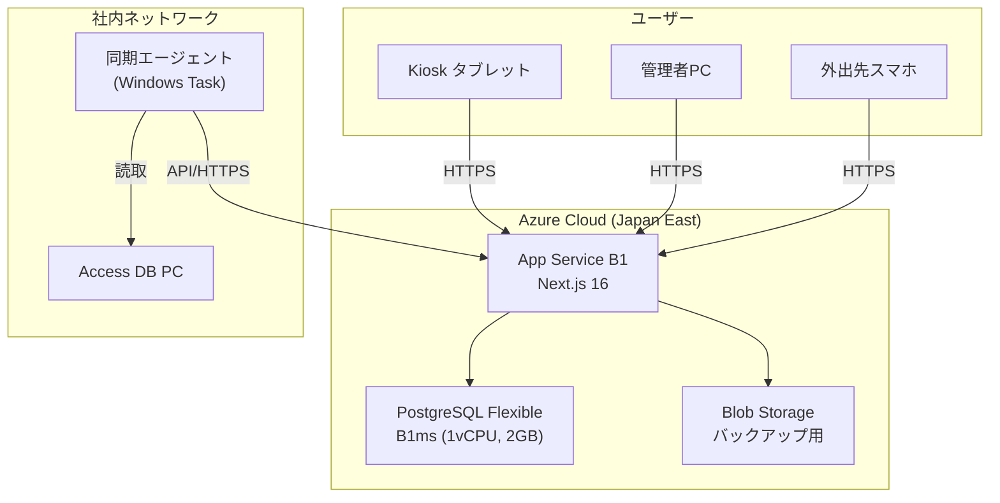

# Azure デプロイ計画書

## 概要

現在ローカルPC上で稼働している STOCK-PWA を Azure クラウドへ移行するための計画。
Access DB（物件情報）との同期方法、必要なAzureリソース、月額コスト見積もりを含む。

---

## 現状のアーキテクチャ

```
┌─────────────────────────────────────────────────────┐
│                  社内ネットワーク                       │
│                                                     │
│  ┌────────────┐    Wi-Fi    ┌────────────┐          │
│  │ Windows PC │◄──────────►│ タブレット   │          │
│  │ Next.js    │             │ (Kiosk)    │          │
│  │ + SQLite   │             └────────────┘          │
│  └─────┬──────┘                                     │
│        │ ネットワーク共有                              │
│        ▼                                            │
│  ┌────────────┐                                     │
│  │ Access DB  │  ← エアコン管理No検索のみに使用        │
│  │ (別PC)     │                                     │
│  └────────────┘                                     │
└─────────────────────────────────────────────────────┘
```

### 課題
- PC故障・停電でシステム停止
- 外出先からアクセス不可
- バックアップが手動依存
- Access DBはOLE DB経由のPowerShellで直接参照（クラウドから直接接続不可）

---

## 提案アーキテクチャ



---

## 移行に必要な作業

### Phase 1: データベース移行（SQLite → PostgreSQL）

| 項目 | 内容 |
|------|------|
| 変更ファイル | `prisma/schema.prisma` |
| 作業内容 | `provider = "sqlite"` → `provider = "postgresql"` に変更 |
| データ移行 | SQLiteからエクスポート → PostgreSQLへインポート |
| 影響範囲 | Prismaが抽象化しているためコード変更は最小限 |

> [!IMPORTANT]
> SQLite固有の機能は使用していないため、`schema.prisma`の`provider`変更とデータ移行のみで対応可能。

### Phase 2: Access DB 同期エージェント

Access DBはOLE DB経由でしかアクセスできないため、**社内PCに常駐する同期エージェント**が必要。

#### 同期方式の選択肢

| 方式 | メリット | デメリット | 推奨度 |
|------|----------|------------|--------|
| **A. 定期バッチ同期** | シンプル、安定 | リアルタイム性なし（最短5分） | ⭐⭐⭐ |
| B. リアルタイムAPI中継 | 即時反映 | 常時起動が必要、複雑 | ⭐⭐ |
| C. Access→CSV→Blob | Access側の変更不要 | 遅延大 | ⭐ |

#### 推奨: 方式A「定期バッチ同期」

```
┌──────────────────────────────────────────────┐
│  社内PC (Windowsタスクスケジューラで定期実行)     │
│                                              │
│  1. Access DB から最新の物件データを取得         │
│     (PowerShell + OLE DB)                    │
│                                              │
│  2. JSON に変換                               │
│                                              │
│  3. Azure上のAPIエンドポイントにPOST送信         │
│     POST https://stock-pwa.azurewebsites.net │
│          /api/sync/access-data               │
│     Header: X-Sync-Key: <秘密鍵>             │
│                                              │
│  実行間隔: 30分〜1時間ごと                      │
└──────────────────────────────────────────────┘
```

> [!NOTE]
> Access DBは「エアコン持出し時の管理No検索」にのみ使用。物件情報は頻繁に変わらないため、定期同期で十分。

#### 必要な新規開発

| 項目 | 内容 |
|------|------|
| `prisma/schema.prisma` | `AccessProject` モデル追加（管理No, 顧客名, 元請, 下請 等） |
| `app/api/sync/access-data/route.ts` | 同期受信APIエンドポイント（認証キー付き） |
| `scripts/sync_access_to_azure.ps1` | 社内PC用の同期スクリプト |
| `lib/aircon-actions.ts` | Access DBの直接参照 → PostgreSQLテーブルへの参照に変更 |

### Phase 3: Azure リソース構築

| リソース | SKU | 用途 |
|----------|-----|------|
| App Service | B1 (1コア, 1.75GB) | Next.js ホスティング |
| PostgreSQL Flexible | B1ms (1vCPU, 2GB) | データベース |
| Blob Storage | Hot LRS | DBバックアップ |

### Phase 4: デプロイパイプライン

```
GitHub Push → Azure App Service (自動デプロイ)
```

- GitHub Actions または Azure DevOps で CI/CD 構築
- `main` ブランチへのpushで自動デプロイ
- デプロイ前に `prisma migrate deploy` を実行

---

## 月額コスト見積もり

> 為替レート: 1 USD = 150 JPY で計算

| リソース | SKU | USD/月 | JPY/月 |
|----------|-----|--------|--------|
| App Service | B1 | $50.00 | ¥7,500 |
| PostgreSQL Flexible | B1ms | $12.41 | ¥1,862 |
| PostgreSQL ストレージ | 32GB | $4.10 | ¥615 |
| Blob Storage | Hot LRS 1GB | $0.02 | ¥3 |
| データ転送 (送信) | ~5GB/月 | $0.44 | ¥66 |
| **合計** | | **$66.97** | **¥10,046** |

### コスト最適化オプション

| オプション | 節約額 | 条件 |
|-----------|--------|------|
| 1年予約 (App Service) | 約30%削減 | 1年コミット |
| F1 Free → B1 段階移行 | 初期は無料 | 制限あり（1GB, カスタムドメイン不可） |
| PostgreSQL停止/起動 | 夜間のコンピュート料金 | 開発環境のみ有効 |

> [!TIP]
> **現実的な月額コスト: 約¥10,000/月（年間約¥120,000）**
> 現在のローカルPC運用の電気代・故障リスク・運用工数と比較して判断してください。

---

## Access DB 同期が不要になるケース

Access DBの利用用途は「管理Noから物件情報（顧客名・元請・下請）を取得する」のみ。

以下のいずれかで同期自体が不要になる可能性あり：

1. **物件情報をSTOCK-PWA内で直接管理する**: 手入力またはExcelインポートで物件マスタを持つ
2. **Access DBをクラウドDBに移行する**: Access自体をPostgreSQLに統合
3. **管理Noの手入力を許容する**: 顧客名等は手入力し、Access参照を廃止

---

## リスクと対策

| リスク | 影響 | 対策 |
|--------|------|------|
| インターネット障害 | Kiosk使用不可 | PWAオフラインキャッシュ強化 |
| Azure障害 | 全機能停止 | 自動バックアップ + ローカルDB復旧手順 |
| Access同期の遅延 | 最新物件情報が反映されない | 手動同期ボタン + Kiosk上の手入力フォールバック |
| PostgreSQLコスト増 | 月額増加 | データ量監視 + 不要ログの定期削除 |

---

## 実施スケジュール（目安）

| フェーズ | 作業内容 | 工数目安 |
|----------|----------|----------|
| Phase 1 | DB移行 (SQLite→PostgreSQL) | 1日 |
| Phase 2 | Access同期エージェント開発 | 2〜3日 |
| Phase 3 | Azureリソース構築 + デプロイ | 1日 |
| Phase 4 | CI/CD + 動作テスト | 1日 |
| Phase 5 | 並行運用（ローカル + Azure） | 1〜2週間 |
| **合計** | | **約1〜2週間** |

---

## 次のアクション（承認後）

1. Azureサブスクリプションの確認（既存 or 新規作成）
2. PostgreSQL Flexibleサーバーの作成
3. `prisma/schema.prisma` の provider 変更 + マイグレーション
4. Access同期スクリプトの開発
5. App Service への初回デプロイ
